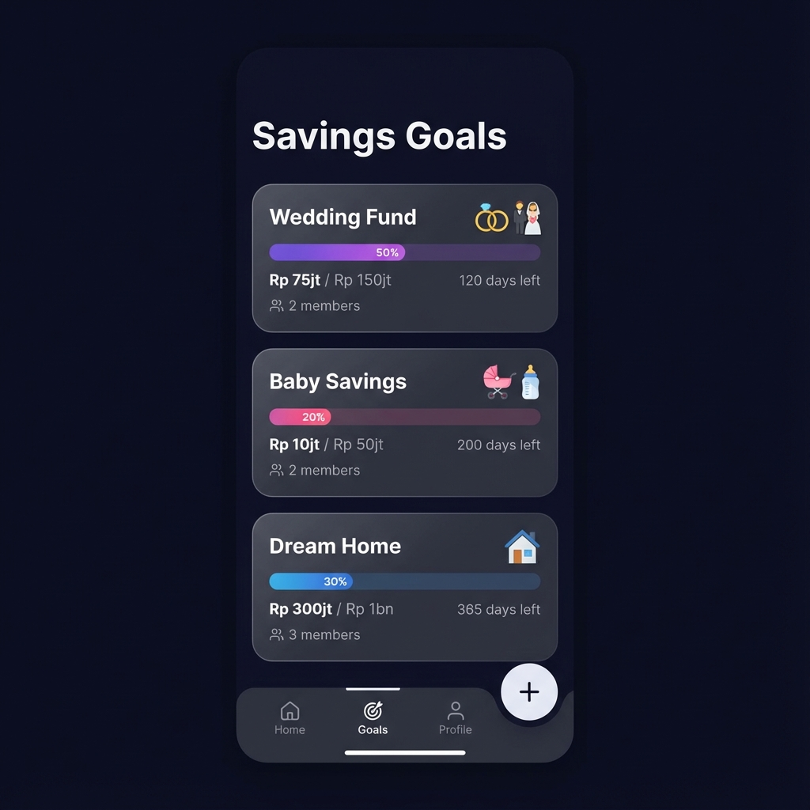
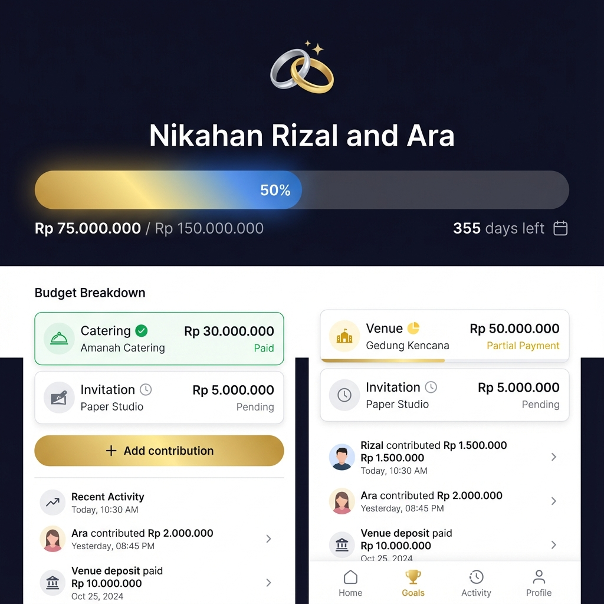
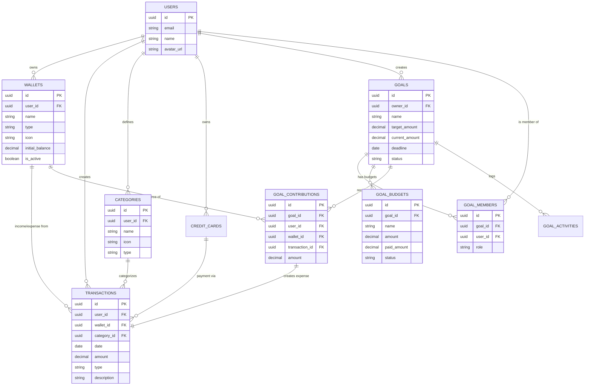
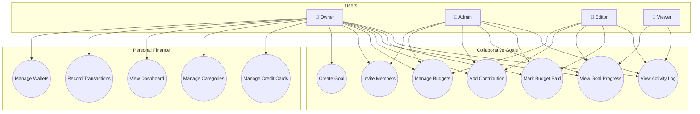
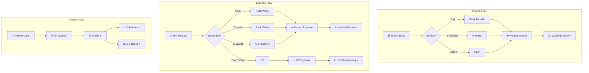
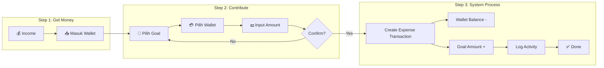
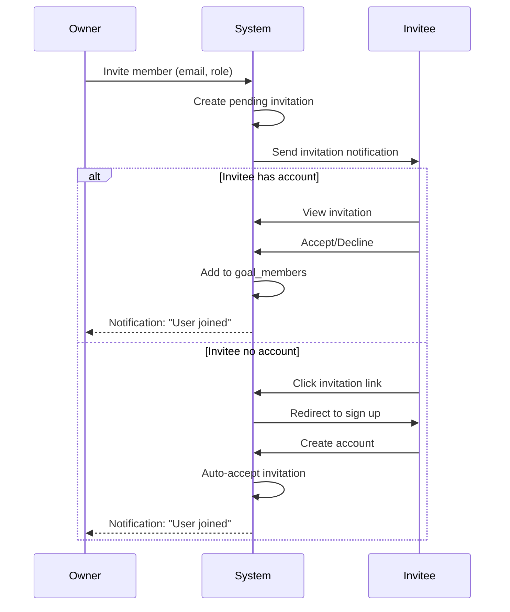
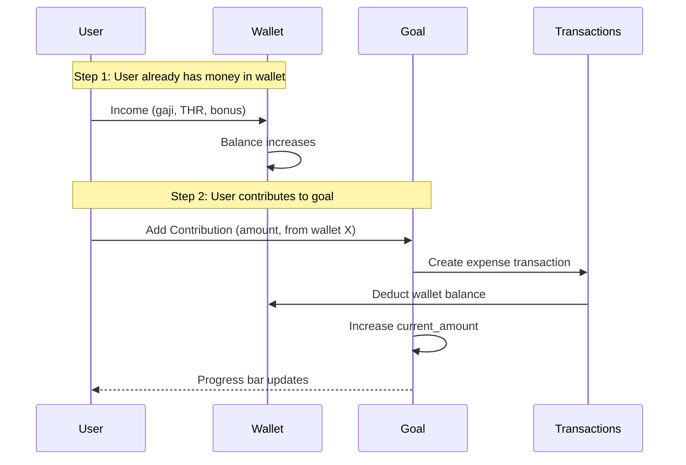

# 💰 Collaborative Savings Goals - Design Document

Fitur dana tujuan kolaboratif untuk event besar (nikahan, lahiran, sekolah, dll) dengan multi-user support.

## UI Mockups





---

## 0. Core Features Overview

### Fitur Utama Wallet-Dap:
1. **Wallets** - Kelola berbagai sumber dana (bank, e-wallet, cash)
2. **Transactions** - Catat income, expense, transfer
3. **Categories** - Kategorisasi transaksi
4. **Credit Cards** - Track kartu kredit & cicilan
5. **Goals** - Dana tujuan kolaboratif
6. **Gold Investment** - Track pembelian & penjualan emas (NEW)

---

## 🥇 Gold Investment Feature

### Konsep
Track investasi emas (misal dari Tring Pegadaian, Tokopedia Emas, dll):
- **Beli Emas**: Uang keluar dari wallet → gram emas bertambah
- **Jual Emas**: Gram emas berkurang → uang masuk ke wallet
- **Portfolio**: Total gram emas yang dimiliki + estimasi nilai

### Database Schema

```sql
-- Gold Holdings (kepemilikan emas)
CREATE TABLE gold_holdings (
  id UUID PRIMARY KEY DEFAULT gen_random_uuid(),
  user_id UUID NOT NULL REFERENCES auth.users(id),
  platform VARCHAR(50) NOT NULL,         -- "Tring Pegadaian", "Tokopedia", "Antam"
  total_grams DECIMAL(10,4) DEFAULT 0,   -- 10.5000 gram
  created_at TIMESTAMPTZ DEFAULT NOW(),
  updated_at TIMESTAMPTZ DEFAULT NOW(),
  UNIQUE(user_id, platform)
);

-- Gold Transactions
CREATE TABLE gold_transactions (
  id UUID PRIMARY KEY DEFAULT gen_random_uuid(),
  user_id UUID NOT NULL REFERENCES auth.users(id),
  holding_id UUID NOT NULL REFERENCES gold_holdings(id),
  type VARCHAR(10) NOT NULL,             -- "buy" atau "sell"
  grams DECIMAL(10,4) NOT NULL,          -- 0.5000 gram
  price_per_gram DECIMAL(15,2) NOT NULL, -- 1.200.000 per gram
  total_amount DECIMAL(15,2) NOT NULL,   -- 600.000
  wallet_id UUID NOT NULL REFERENCES wallets(id),
  transaction_id UUID REFERENCES transactions(id), -- Link ke expense/income
  notes TEXT,
  date DATE NOT NULL,
  created_at TIMESTAMPTZ DEFAULT NOW()
);
```

### Flow Diagram

```
┌─────────────────────────────────────────────────────────────────────┐
│                         BELI EMAS                                   │
│  Wallet ──(expense)──> Gold Holding                                 │
│  Rp 600.000            +0.5 gram                                    │
└─────────────────────────────────────────────────────────────────────┘

┌─────────────────────────────────────────────────────────────────────┐
│                         JUAL EMAS                                   │
│  Gold Holding ──────> Wallet                                        │
│  -0.5 gram            +Rp 650.000 (income)                          │
└─────────────────────────────────────────────────────────────────────┘
```

### User Flow

**Beli Emas:**
```
1. User → Gold Page → [+ Beli Emas]
2. Pilih platform (Tring/Tokopedia/dll)
3. Input: gram, harga per gram
4. Pilih wallet sumber dana
5. Confirm → System:
   - Buat expense transaction di wallet
   - Update gold_holdings (total_grams +)
   - Buat gold_transaction record
```

**Jual Emas:**
```
1. User → Gold Page → [Jual Emas]
2. Pilih holding (platform mana)
3. Input: gram yang dijual, harga jual per gram
4. Pilih wallet tujuan dana
5. Confirm → System:
   - Update gold_holdings (total_grams -)
   - Buat income transaction di wallet
   - Buat gold_transaction record
```

### UI Pages

**Gold Portfolio (`/gold`)**
```
┌─────────────────────────────────────────────────┐
│  🥇 Emas Saya                                   │
├─────────────────────────────────────────────────┤
│  Total: 15.5 gram                               │
│  Estimasi: Rp 18.600.000 (@Rp1.2jt/gram)        │
│                                                 │
│  ┌─────────────────────────────────────────┐    │
│  │ 📱 Tring Pegadaian       10.0 gram      │    │
│  │    Rp 12.000.000                        │    │
│  └─────────────────────────────────────────┘    │
│  ┌─────────────────────────────────────────┐    │
│  │ 🛒 Tokopedia Emas        5.5 gram       │    │
│  │    Rp 6.600.000                         │    │
│  └─────────────────────────────────────────┘    │
│                                                 │
│  [+ Beli Emas]   [Jual Emas]                    │
├─────────────────────────────────────────────────┤
│  📜 RIWAYAT                                     │
│  • Beli 0.5g @Rp1.2jt - Tring (kemarin)        │
│  • Jual 1.0g @Rp1.25jt - Tokped (3 hari lalu)  │
└─────────────────────────────────────────────────┘
```

### API Endpoints

| Method | Endpoint | Description |
|--------|----------|-------------|
| GET | `/api/gold` | List all holdings |
| POST | `/api/gold/buy` | Buy gold (creates expense + updates holding) |
| POST | `/api/gold/sell` | Sell gold (creates income + updates holding) |
| GET | `/api/gold/transactions` | Gold transaction history |

---

## A. Entity Relationship Diagram (ERD)



---

## B. Use Case Diagram



---

## C. Transaction Flow Diagram



---

## D. Goal Contribution Flow



---

## E. Member Invitation Flow



---

## 1. Database Schema

### New Tables

```sql
-- Savings Goals
CREATE TABLE goals (
  id UUID PRIMARY KEY DEFAULT gen_random_uuid(),
  owner_id UUID NOT NULL REFERENCES auth.users(id),
  name VARCHAR(100) NOT NULL,           -- "Nikahan Rizal & Ara"
  icon VARCHAR(10) NOT NULL,            -- "💒"
  color VARCHAR(10) NOT NULL,           -- "#6366f1"
  target_amount DECIMAL(15,2) NOT NULL, -- 150.000.000
  current_amount DECIMAL(15,2) DEFAULT 0,
  deadline DATE,                        -- 2026-12-28
  status VARCHAR(20) DEFAULT 'active',  -- active, completed, cancelled
  description TEXT,
  created_at TIMESTAMPTZ DEFAULT NOW(),
  updated_at TIMESTAMPTZ DEFAULT NOW()
);

-- Goal Members (collaborative access)
CREATE TABLE goal_members (
  id UUID PRIMARY KEY DEFAULT gen_random_uuid(),
  goal_id UUID NOT NULL REFERENCES goals(id) ON DELETE CASCADE,
  user_id UUID NOT NULL REFERENCES auth.users(id),
  role VARCHAR(20) NOT NULL,            -- owner, admin, editor, viewer
  invited_by UUID REFERENCES auth.users(id),
  invited_at TIMESTAMPTZ DEFAULT NOW(),
  accepted_at TIMESTAMPTZ,
  UNIQUE(goal_id, user_id)
);

-- Goal Budgets (item breakdown)
CREATE TABLE goal_budgets (
  id UUID PRIMARY KEY DEFAULT gen_random_uuid(),
  goal_id UUID NOT NULL REFERENCES goals(id) ON DELETE CASCADE,
  name VARCHAR(100) NOT NULL,           -- "Catering 500 orang"
  amount DECIMAL(15,2) NOT NULL,        -- 25.000.000
  paid_amount DECIMAL(15,2) DEFAULT 0,
  vendor VARCHAR(100),                  -- "Bu Tini Catering"
  status VARCHAR(20) DEFAULT 'pending', -- pending, partial, paid
  due_date DATE,
  notes TEXT,
  created_by UUID REFERENCES auth.users(id),
  created_at TIMESTAMPTZ DEFAULT NOW()
);

-- Goal Contributions (uang masuk ke goal dari wallet)
CREATE TABLE goal_contributions (
  id UUID PRIMARY KEY DEFAULT gen_random_uuid(),
  goal_id UUID NOT NULL REFERENCES goals(id) ON DELETE CASCADE,
  user_id UUID NOT NULL REFERENCES auth.users(id),
  amount DECIMAL(15,2) NOT NULL,
  wallet_id UUID NOT NULL REFERENCES wallets(id), -- WAJIB dari wallet
  transaction_id UUID REFERENCES transactions(id), -- Link ke expense transaction
  notes TEXT,
  created_at TIMESTAMPTZ DEFAULT NOW()
);

-- NOTE: Saat add contribution, otomatis buat transaction expense di wallet

-- Activity Log (audit trail)
CREATE TABLE goal_activities (
  id UUID PRIMARY KEY DEFAULT gen_random_uuid(),
  goal_id UUID NOT NULL REFERENCES goals(id) ON DELETE CASCADE,
  user_id UUID NOT NULL REFERENCES auth.users(id),
  action VARCHAR(50) NOT NULL,          -- "added_budget", "paid_budget", "invited_member"
  details JSONB,                        -- { budgetName: "Catering", amount: 25000000 }
  created_at TIMESTAMPTZ DEFAULT NOW()
);
```

---

## 2. Permission Matrix

| Role | View Goal | Edit Goal | Add Budget | Edit Budget | Add Contribution | Invite Members | Delete Goal |
|------|-----------|-----------|------------|-------------|------------------|----------------|-------------|
| **Owner** | ✅ | ✅ | ✅ | ✅ | ✅ | ✅ | ✅ |
| **Admin** | ✅ | ✅ | ✅ | ✅ | ✅ | ✅ | ❌ |
| **Editor** | ✅ | ❌ | ✅ | ✅ (own) | ✅ | ❌ | ❌ |
| **Viewer** | ✅ | ❌ | ❌ | ❌ | ❌ | ❌ | ❌ |

---

## 3. User Flows

### 3.1 Create Goal
```
User → Goals Page → [+ New Goal] → Fill form → Created → Redirect to Goal Detail
```

### 3.2 Invite Member
```
Owner → Goal Detail → [👥 Members] → [Invite] → Enter email → Select role → Send invite
→ Invitee receives notification → Accept/Decline → Added to goal
```

### 3.3 Add Budget
```
Member (editor+) → Goal Detail → Budgets section → [+ Add Budget]
→ Fill name, amount, vendor, due date → Save → Updates goal budget list
```

### 3.4 Add Contribution (Linked to Wallet)
```
Flow: Income → Wallet → Contribution → Goal

1. User sudah punya uang di Wallet (dari gaji, THR, hadiah, dll)
2. User buka Goal → [+ Kontribusi]
3. Pilih Wallet sumber → Input jumlah → Save
4. System otomatis:
   - Buat expense transaction di wallet tersebut
   - Tambah goal.current_amount
   - Log activity
5. Balance wallet berkurang, goal progress bertambah
```

### 3.5 Mark Budget as Paid
```
Member (editor+) → Budget item → [Mark as Paid] → Enter paid amount
→ Status updates → Contribution auto-created if linked to wallet
```

---

## 4. UI Pages

### 4.1 Goals List (`/goals`)
```
┌─────────────────────────────────────────────────┐
│  📋 Dana Tujuan                    [+ New Goal] │
├─────────────────────────────────────────────────┤
│  ┌─────────────────────────────────────────┐    │
│  │ 💒 Nikahan Rizal & Ara        50%       │    │
│  │ ████████████░░░░░░░░░░░░░░░░░           │    │
│  │ Rp 75jt / Rp 150jt • 355 hari lagi      │    │
│  │ 👥 3 members                             │    │
│  └─────────────────────────────────────────┘    │
│  ┌─────────────────────────────────────────┐    │
│  │ 👶 Dana Lahiran                 20%      │    │
│  │ ██████░░░░░░░░░░░░░░░░░░░░░░░           │    │
│  │ Rp 10jt / Rp 50jt • No deadline         │    │
│  │ 👥 2 members                             │    │
│  └─────────────────────────────────────────┘    │
└─────────────────────────────────────────────────┘
```

### 4.2 Goal Detail (`/goals/[id]`)
```
┌─────────────────────────────────────────────────┐
│  ← Back                             👥 ⚙️       │
├─────────────────────────────────────────────────┤
│  💒 Nikahan Rizal & Ara                         │
│  ████████████░░░░░░░░░░                 50%     │
│  Rp 75.000.000 / Rp 150.000.000                 │
│  Target: 28 Des 2026 (355 hari lagi)            │
│  Perlu nabung: Rp 210.000/hari                  │
│                                                 │
│  [+ Kontribusi]                                 │
├─────────────────────────────────────────────────┤
│  📋 BUDGET (8 items)                            │
│  ┌─────────────────────────────────────────┐    │
│  │ ✅ Catering 500 org    Rp 25.000.000    │    │
│  │    Bu Tini • Lunas                      │    │
│  ├─────────────────────────────────────────┤    │
│  │ ⏳ Gedung             Rp 40.000.000     │    │
│  │    Hotel XYZ • DP 50%                   │    │
│  ├─────────────────────────────────────────┤    │
│  │ ○ Undangan           Rp 2.000.000       │    │
│  │    Belum dibayar                        │    │
│  └─────────────────────────────────────────┘    │
│  [+ Add Budget]                                 │
├─────────────────────────────────────────────────┤
│  📝 RECENT ACTIVITY                             │
│  • Rizal added Rp 5.000.000 (2 jam lalu)        │
│  • Ara marked Catering as paid (kemarin)        │
│  • Rizal invited mama@email.com (3 hari lalu)   │
└─────────────────────────────────────────────────┘
```

---

## 5. API Endpoints

| Method | Endpoint | Description |
|--------|----------|-------------|
| GET | `/api/goals` | List user's goals (owned + member) |
| POST | `/api/goals` | Create new goal |
| GET | `/api/goals/[id]` | Get goal detail with budgets |
| PUT | `/api/goals/[id]` | Update goal |
| DELETE | `/api/goals/[id]` | Delete goal (owner only) |
| POST | `/api/goals/[id]/budgets` | Add budget |
| PUT | `/api/goals/[id]/budgets/[budgetId]` | Update budget |
| DELETE | `/api/goals/[id]/budgets/[budgetId]` | Delete budget |
| POST | `/api/goals/[id]/contributions` | Add contribution |
| POST | `/api/goals/[id]/members` | Invite member |
| PUT | `/api/goals/[id]/members/[memberId]` | Update member role |
| DELETE | `/api/goals/[id]/members/[memberId]` | Remove member |
| POST | `/api/goals/invite/accept` | Accept invitation |

---

## 6. Implementation Phases (Fresh Start)

### Phase 1: Setup Supabase
- [ ] Create new Supabase project
- [ ] Setup auth dengan Google OAuth
- [ ] Run schema SQL (wallets, transactions, categories, goals, etc)

### Phase 2: Core Features
- [ ] Wallets CRUD
- [ ] Transactions CRUD
- [ ] Categories CRUD
- [ ] Dashboard summary

### Phase 3: Goals Feature
- [ ] Goals CRUD
- [ ] Budgets CRUD
- [ ] Contributions (linked to wallet)
- [ ] Member invitation system
- [ ] Activity logging

### Phase 4: Polish
- [ ] Realtime sync between members
- [ ] Notifications
- [ ] Export/reporting

---

## 7. Tech Stack

| Component | Stack |
|-----------|-------|
| Database | **Supabase (PostgreSQL)** |
| Auth | **Supabase Auth** (Google OAuth) |
| Realtime | **Supabase Realtime** |
| Storage | **Supabase Storage** (receipts) |
| Frontend | Next.js + Supabase SDK |

---

## 8. Contribution Flow Diagram


